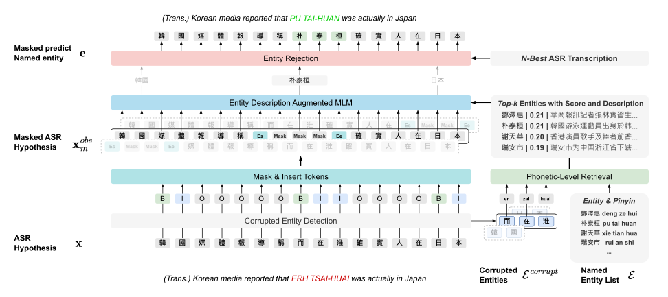

# DANCER💃: Entity Description Augmented Named Entity Corrector for Automatic Speech Recognition

Implementation of Entity Description Augmented Named Entity Corrector for Automatic Speech Recognition.

## Getting Started

### Dependency / Install

(This work was tested with PyTorch 2.0.1, CUDA 11.7, python 3.8, and Ubuntu 20.04.)

- Install [PyTorch](https://pytorch.org/get-started/locally/)
- Install [Faiss](https://github.com/facebookresearch/faiss/blob/main/INSTALL.md)
- `$ pip install -r requirements`


## Scripts

```
$ git clone https://github.com/Amiannn/Dancer.git
```

### Prediction

```bash
$ python3 -m entity_correction \
    --asr_transcription_path "./datas/aishell_test_set/asr_transcription/conformer/hyp"         \
    --asr_nbest_transcription_path "./datas/aishell_test_set/asr_transcription/conformer/nbest" \
    --asr_manuscript_path "./datas/aishell_test_set/ref"                                        \
    --entity_path "./datas/entities/aishell/test_1_entities.txt"                                \
    --entity_content_path "./datas/entities/aishell/descriptions"                               \
    --entity_vectors_path "./datas/entities/aishell/descriptions/embeds.npy"                    \
    --detection_model_type "bert_detector"                                                      \
    --detection_model_path "./ckpts/ner/best_model"                                             \
    --retrieval_model_type "prsr_retriever"                                                     \
    --retrieval_model_path "./ckpts/ranker/dpr_biencoder.39"                                    \
    --use_rejection "True"
```

### Train CED Model

For example, we train CED model on Aishell dataset as follows:

```bash
$ python3 -m train_ced \
    --train_path "./datas/ced/aishell_trainset_plus_conformer_nbest10_trainset_decode_result.json" \
    --model_type "bert-base-chinese"                                                               \
    --wandb "DANCER_CED_EXP"                                                                       \
    --epoch 10                                                                                     \
    --batch 256
```

### Train Semantic Ranking Model

For example, we train EDA-MLM on Aishell dataset as follows:

```
Coming soon
```

### Evaluation

```
Coming soon
```

## Datas
- Download [Google-Drive](https://drive.google.com/drive/folders/1C1W80ZhgM9i_W65iS4Wzxz2yF0FHmGRF?usp=drive_link)

## Checkpoints
- Download [Google-Drive](https://drive.google.com/drive/folders/1FODc095S1MclrpIzcmVxA8Yrh1gb_eEz?usp=drive_link)
